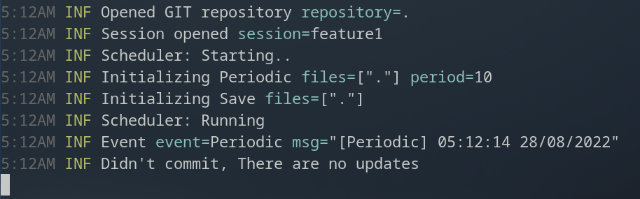

<div align="center">
    <h1>Chrono</h1>
    
</div>
<div align="center">
    <p><strong>A Git Time Machine</strong></p>
    
    
</div>

---

<p align="center">
    Chrono <strong>automatically</strong> commits in a temporary branch every time a <i>costumizable</i> event occurs.
</p>
<p align="center">
    
</p>
<p align="center">
    So that you can always <strong>rollback</strong> to a specific point in time if anything goes wrong.
</p>
<p align="center">
    You can <strong>squash merge</strong> all the temporary commits into one once you are done.
</p>

---

## Disclaimer
This is still in early development stages.

If you are going to use it or test it, ***please use with caution***.

Use at your own risk, I am ***NOT*** responsible for any of your acts.

---

## How to install

```bash
git clone https://github.com/hazyuun/Chrono.git
cd Chrono
go install .
```
> Make sure you have `go` installed, if not, you can easily install it using your package manager

The binary will be installed into `~/go/bin/` by default, make sure it is in your `PATH` environment variable, if not, you can add it using:

```bash
export PATH="$HOME/go/bin/:$PATH"
```
> Note that this will add `~/go/bin/` to `PATH` just for the current terminal session, you can add that line to your `~/.profile` for a permanent effect.

Now you can run the following command to check if it is installed correctly:

```bash
chrono --help
```

---

## Workflow
### Create a chrono session

Create a new session using:

```bash
$ chrono session create session_name
```
<b>Important:</b> Please note that this will create a branch from the current HEAD, so make sure it is currently in the commit where you want to create the chrono session.

You can create as many sessions as you want, to list existing sessions you can run the following command:

```bash
$ chrono session list
```


---

### Start a Chrono session
Start a Chrono session using:
```bash
$ chrono session start session_name
```
From now on, Chrono will be automatically committing changes to the session's specific branch whenever an event occurs.

> <b>Important:</b> Please note that after you stop running this command, you will still be in the session branch for convinience.

Events are customizable using a `chrono.yaml` file (see [below](#config-file) for details).

---

### Squash merge and delete the session
When done, you can merge (A squash merge is recommended) the Chrono branch to your original branch (let's call it original_branch):
```bash
$ git checkout original_branch
$ git merge --squash chrono/session_name
```
Then if everything is as expected, you can commit the merge:
```bash
$ git commit -m "Your commit message"
```
...and delete the session:
```bash
$ chrono session delete session_name
```
---

## Config file
Put a file named `chrono.yml` in the root of your repository.

Here is an example config file:
```yaml

# Events when to automatically commit
events:
    # This triggers every amount of minutes
    - periodic:

        # Every 60 seconds
        period: 60

        # Commit those files
        files: ["src/", "file.txt"] 

    # This triggers every file save
    - save:

        # Those files will be committed once they're saved
        files: ["notes.txt"]
        
# Use files: ["."] if you want all files to be commited
```

If you want to exclude some files when using `files: ["."]`, just use your regular `.gitignore` file.

---

## Contributions

Pull requests and issues are welcome !
